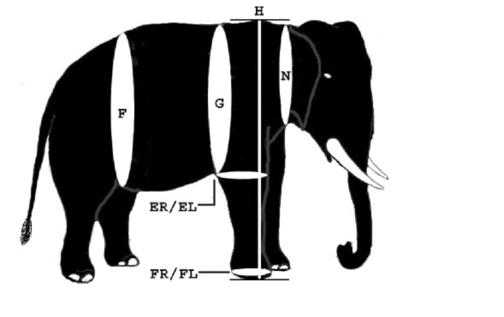

---
categories:
- tranquilpeak
- features
coverImage: /ele.png
coverMeta: out
date: "2023-05-11"
metaAlignment: center
tags:
- cover image
thumbnailImage: /ele.png
thumbnailImagePosition: left
title: Case study
---

Image was directly taken fromthe paper:  Kanchanapangka, S., Supawong, S., Koedlab, K., Kaewpannarai, J., Khawnual, P., Tummaruk, P., & Sajjarengpong, K. (2007). Body weight formulation in Asian elephant. The Thai Journal of Veterinary Medicine, 37(1), 49-58.

Data: Load [here](/data/elephants.csv)

